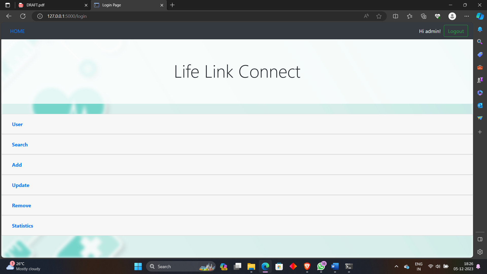
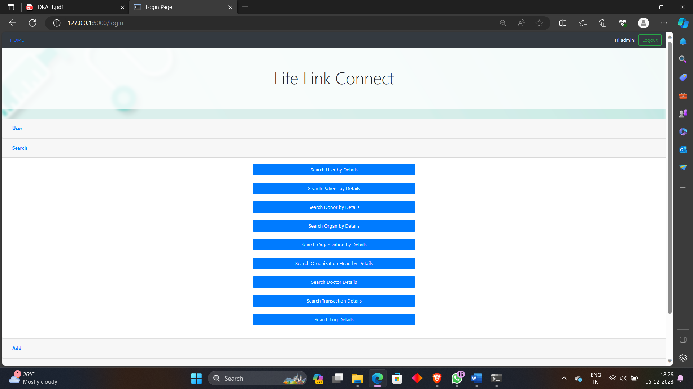
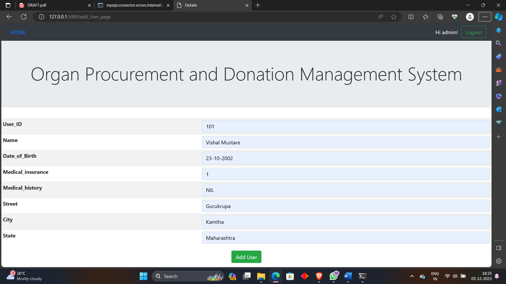
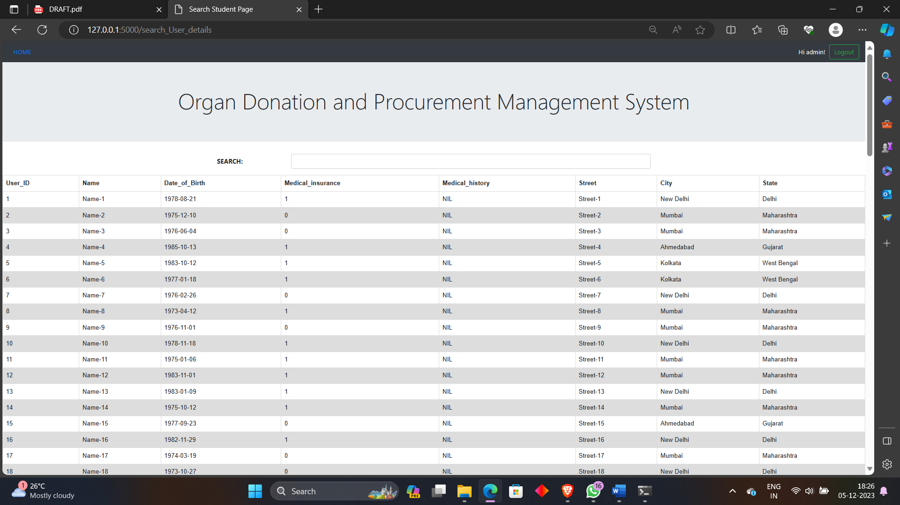
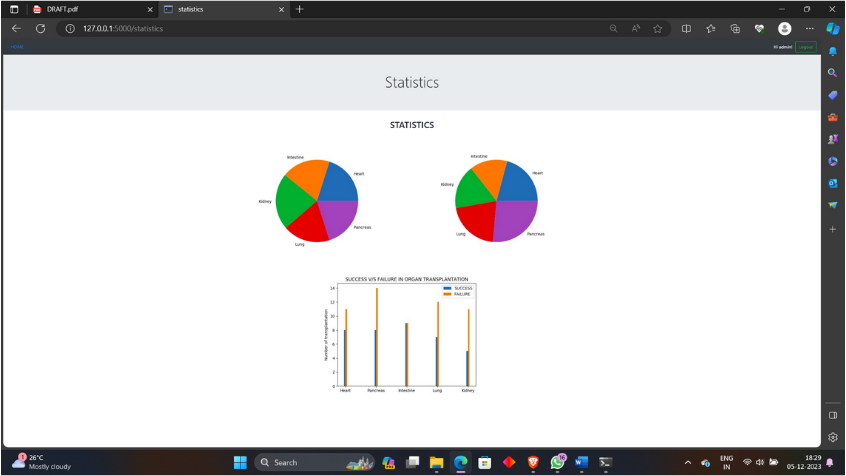
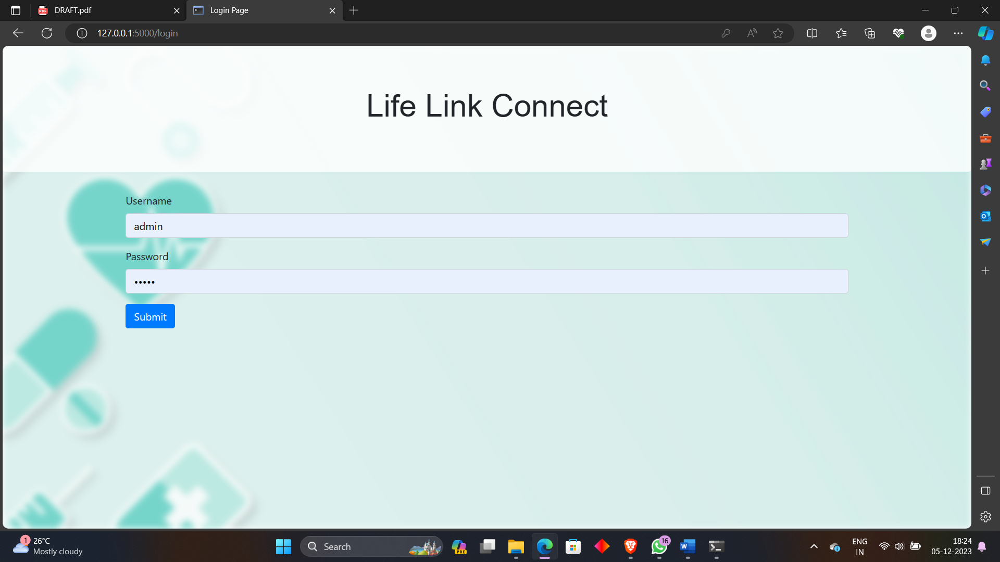

# Link Life Connect

## Introduction

**Link Life Connect** is a comprehensive Organ Management Database Management System (DBMS) that I developed to enhance the management of organ donation and transplantation processes.

### Key Features

- **Data Visualization**
- **Search Functionality**
- **Add and Edit Records**
- **User-Friendly Interface**
- **Backend Integration**

## Installation and Setup

### Step 1: Create the Database

Import the `create_tables.sql` file to set up the database.

### Step 2: Configure the Application

Open `main.py` and update the MySQL password.

### Step 3: Run the Application

Execute the `main.py` file.

### Step 4: Access the Application

Open your browser and navigate to `http://localhost:5000`.
## Screenshots
## Screenshots

### Application Screenshots

#### Home Page

#### Dashboard

#### User Profile

### Data Visualization

#### Graphical Reports

#### Statistical Overview

### Interface Examples

#### Login Page

#### Settings
 <!-- Path to settings screenshot needed -->

#### Notifications
 <!-- Path to notifications screenshot needed -->

